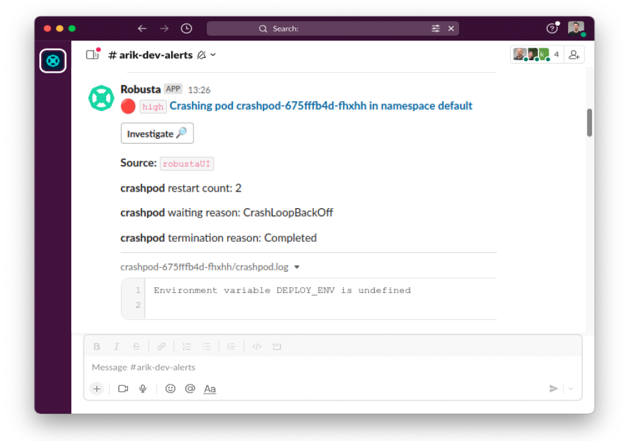
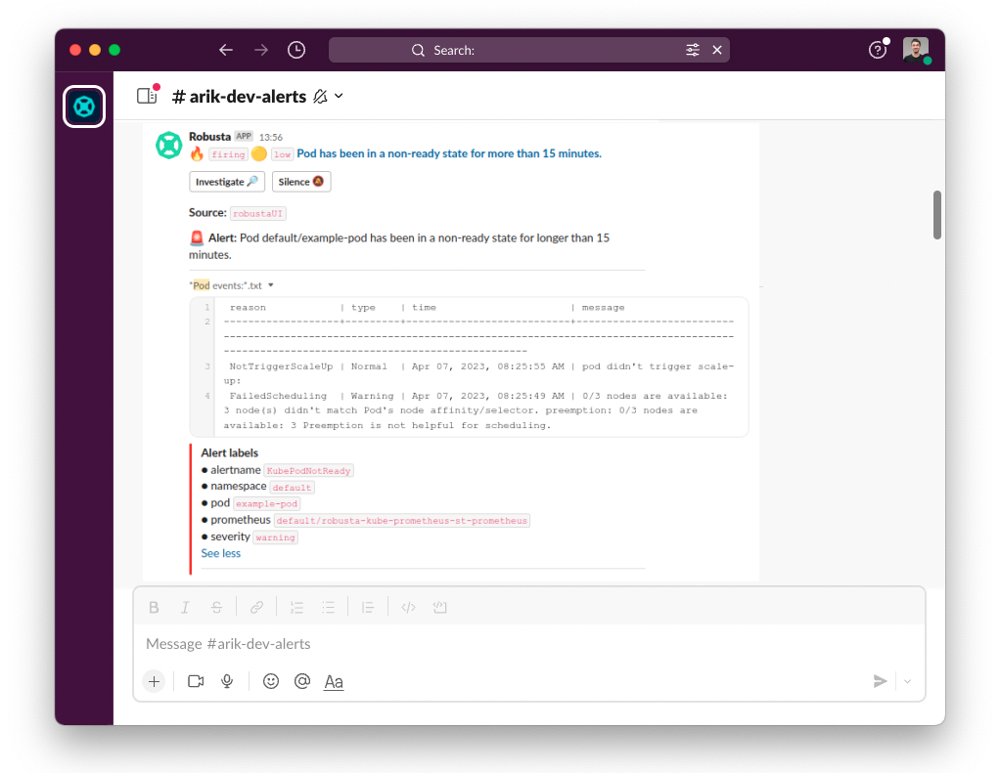
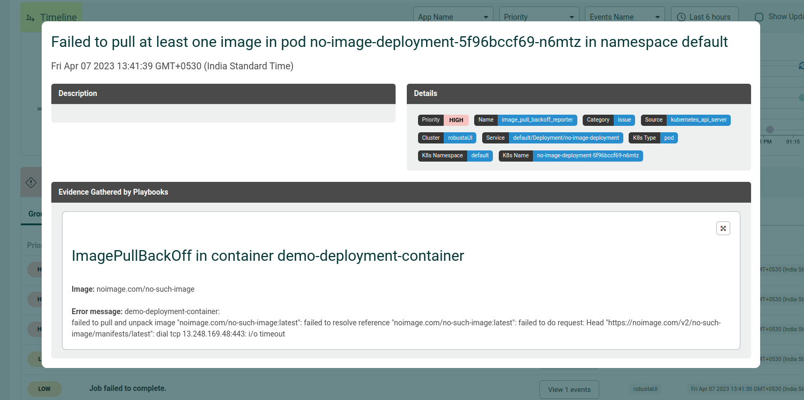
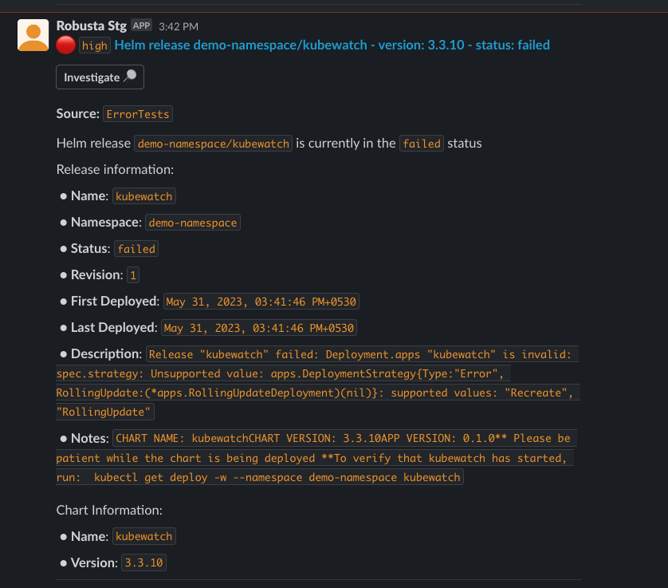
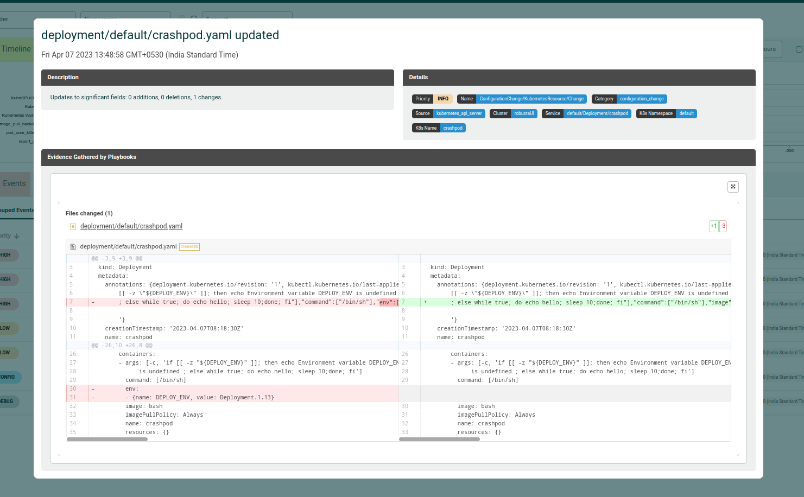
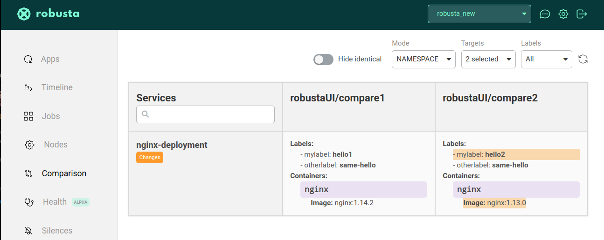

# Introduction 
Practice Kubernetes troubleshooting with realistic error scenarios.

Each scenario is run with `kubectl apply` commands. To cleanup, run `kubectl delete` on the same.

# Scenarios

## Pod Issues

### Crashing Pod (CrashLoopBackoff)

```
kubectl apply -f https://raw.githubusercontent.com/robusta-dev/kubernetes-demos/main/crashpod/broken.yaml
```
<details>
<summary>Example: </summary>

</details>

### OOMKilled Pod (Out of Memory Kill)

```
kubectl apply -f https://raw.githubusercontent.com/robusta-dev/kubernetes-demos/main/oomkill/oomkill_job.yaml
```
<details>
<summary>Example: </summary>

</details>

### High CPU Throttling (CPUThrottlingHigh)

Apply the following YAML and wait **15 minutes**. (CPU throttling is only an issue if it occurs for a meangingful periods of time. Less than 15 minutes of throttling typically does not trigger an alert.)

```
kubectl apply -f https://raw.githubusercontent.com/robusta-dev/kubernetes-demos/main/cpu_throttling/throttling.yaml
```
<details>
<summary>Example: </summary>

</details>

### Pending Pod

Apply the following YAML and wait **15 minutes**. (By default, most systems only alert after pods are pending for 15 minutes. This prevents false alarms on autoscaled clusters, where its OK for pods to be temporarily pending.)

```
kubectl apply -f https://raw.githubusercontent.com/robusta-dev/kubernetes-demos/main/pending_pods/pending_pod_node_selector.yaml
```
<details>
<summary>Example: </summary>

</details>

### ImagePullBackOff

```
kubectl apply -f https://raw.githubusercontent.com/robusta-dev/kubernetes-demos/main/image_pull_backoff/no_such_image.yaml
```
<details>
<summary>Example: </summary>

</details>

### Liveness Probe
Apply the following YAML to simulate a Liveness probe fail.

```
kubectl apply -f https://raw.githubusercontent.com/robusta-dev/kubernetes-demos/main/liveness_probe_fail/failing_liveness_probe.yaml
```
<details>
<summary>Example: </summary>

</details>

## Job Issues

### Failing Job

Deploy a failing job. The job will fail after 60 seconds, then attempt to run again. After two attempts, it will fail for good.

```
kubectl apply -f https://raw.githubusercontent.com/robusta-dev/kubernetes-demos/main/job_failure/job_crash.yaml
```
<details>
<summary>Example: </summary>

</details>


## Helm Monitoring

Add robusta's helm chart repository:
```shell
helm repo add robusta https://robusta-charts.storage.googleapis.com && helm repo update
```

Deploy a failing release:
```shell
helm install kubewatch robusta/kubewatch --set='rbac.create=true,updateStrategy.type=Error' --namespace demo-namespace --create-namespace
```

Deploy a successful release:
```shell
helm upgrade kubewatch robusta/kubewatch --set='rbac.create=true' --namespace demo-namespace --create-namespace
```

Uninstall kubewatch:
```shell
helm del kubewatch  --namespace demo-namespace 
```

Delete the test namespace:
```shell
kubectl delete namespace demo-namespace 
```

<details>
<summary>Example: </summary>


An example of broken Helm release, using Robusta's [Helm Releases Monitoring](https://docs.robusta.dev/master/playbook-reference/triggers/helm-releases-monitoring.html) feature.
</details>


## Other Demos

### Change Tracking

Deploy a healthy pod. Then break it.

```shell
kubectl apply -f https://raw.githubusercontent.com/robusta-dev/kubernetes-demos/main/crashpod/healthy.yaml
kubectl apply -f https://raw.githubusercontent.com/robusta-dev/kubernetes-demos/main/crashpod/broken.yaml
```

Now audit your cluster. If someone else made this change, would you be able to pinpoint the change that broke the application?

<details>
<summary>Example: </summary>

</details>

### Deployment Image Change Tracking

Create an nginx deployment. Then change the image tag to simulate an unexpected image tag change.

```shell
kubectl apply -f https://raw.githubusercontent.com/robusta-dev/kubernetes-demos/deployment_image_change/before_image_change.yaml
kubectl apply -f https://raw.githubusercontent.com/robusta-dev/kubernetes-demos/deployment_image_change/after_image_change.yaml
```
Did you immediately get notified about a change in the image tag? Note: You will need to configure a playbook for this to work. Instructions coming soon!

<details>
<summary>Example: </summary>

</details>


### Drift and Namespace Comparison

```shell
kubectl apply -f https://raw.githubusercontent.com/robusta-dev/kubernetes-demos/main/namespace_drift/example.yaml
```

Can you quickly tell the difference between the `compare1` and `compare2` namespaces? What is the drift between them?

<details>
<summary>Example: </summary>

</details>

## High overhead of GKE Nodes

On GKE, nodes can reserve more than 50% of CPU for themselves. Users pay for CPU that is unavailable to applications.

Reproduction:

1. Create a default GKE cluster with autopilot disabled. Don't change any other settings.
2. Deploy the following pod:

```
kubectl apply -f https://raw.githubusercontent.com/robusta-dev/kubernetes-demos/main/gke_node_allocatable/gke_issue.yaml
```

3. Run `kubectl get pods -o wide gke-node-allocatable-issue`

The pod will be Pending. **A Pod requesting 1 CPU cannot run on an empty node with 2 CPUs!**

<details>
<summary>Example: </summary>

</details>

